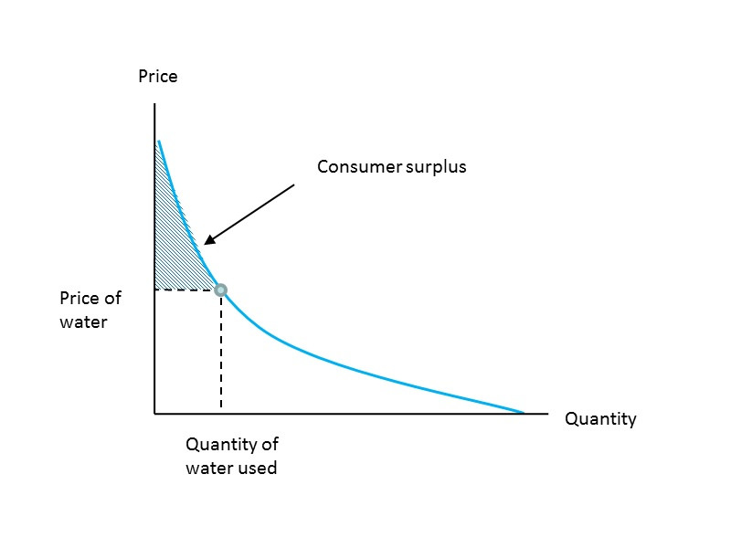

% Valuable Skills
% Daniel Waterworth
% February 5, 2018

*This blog post is actually a follow-on from my previous post on
learning [^1], but it's taken days to find the words to describe the
ideas here.*

In my last post on learning, I talked about how, if you want to master
some skill, you need to find a series of progressively more difficult
stepping stones to train on. Now, what I want to characterise is the
kinds of skills that are valuable.

In economics, the value of a thing is inextricably linked to its
scarcity and usefulness.

Water is extremely useful, even vital, but because it is (relatively)
plentiful, its value is low. On the other hand, platinum is somewhat
useful and scarce. Its value is extremely high.

You can see this relationship in demand curves:

Here, the blue line shows you what the market-price would be if you there
were a specific quantity available, or contrariwise the required scarcity
needed to hit a certain price-point.

So, the usefulness of a thing determines its demand-curve. Combining the
demand-curve with the thing's scarcity determines its price. So far, so
straight-forward.

Getting back on point: your time is both useful and scarce and so it has
a demand-curve too. However, for most of the things that you do, your
time is substitutable for someone else's.

*Even if you are the world's fastest box stacker, your time is
substitutable. Your employer would just need to hire more than one
person to replace you.*

Substitutabilty reduces the demand for your time and so decreases its
value. To make your time more valuable, you must learn skills that
others don't have so that your time isn't as substitutable.

All of that was to say, **we are entering the age of the specialist.**

Gone are the days when having a degree guaranteed you a good job. Good
jobs today require more from you. Everything you learned in your degree
course was taught to everyone else in your class and in thousands
of classes around the world. Worse, with the rise of the internet, any
determined individual can find video lectures and notes on any subject
they desire.

Valuable skills are the ones that no one else has. They are not
taught. No, valuable skills are honed in through self-directed
curiosity.

Tying this back to the process of learning, skills where the stepping
stones aren't obvious are more valuable than skills where they are. If
others easily follow you as you traverse the waters, the journey isn't
worthwhile.

**Today, it is what makes you unique that makes you valuable.**

So, embrace your inner uniqueness:

<iframe width="560" height="315" src="https://www.youtube-nocookie.com/embed/c47kn_Y4y8A?rel=0" frameborder="0" allow="autoplay; encrypted-media" allowfullscreen></iframe>

[^1]: [Understanding the Mechanics of Learning](./2018_01_29.html)
